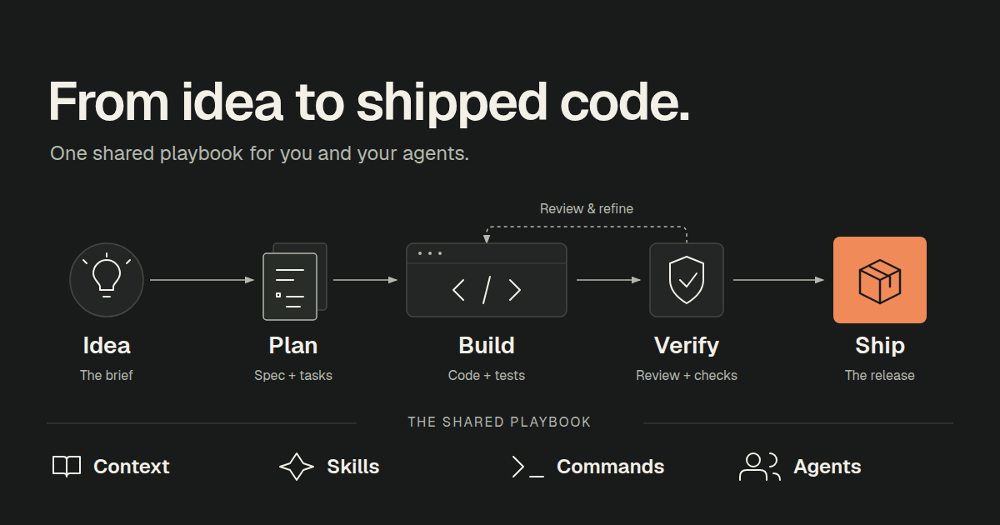

<!-- markdownlint-configure-file {"MD033": {"allowed_elements": ["p", "img", "div"]}, "MD041": false} -->

<p align="center">
  
</p>

<div align="center">

My personal, curated set of artifacts for AI coding agents that I actually use day-to-day, permissively licensed for others to adapt. One set of rules, skills, and agents that follows me across every AI coding tool.

[](https://github.com/sergeyklay/.agents/actions/workflows/ci.yml)

</div>

Clone it once, run the installer, and Claude Code, Codex, Copilot, Gemini, and opencode all read the same instructions - no copy-pasting between config directories, no drift between machines.

## The Problem

Every AI coding host invents its own config directories, file formats, and frontmatter fields. Keeping your rules and skills in sync across five hosts and several machines means hand-editing the same content again and again - and the copies quietly drift apart.

## How It Works

This repository holds one canonical copy of everything: working rules, agent skills that follow the published [specification](https://agentskills.io), and agents for each host. A single script, `scripts/install.sh`, adds the host-specific fields each tool expects and writes every file to where that host reads it.

## This is NOT

- an "awesome-*" list,
- a dump of AI slop scraped off the internet,
- a showcase of every trending prompt the algorithm pushed this week.

Everything here earns its place by being something I actually reach for in daily work. When something stops pulling its weight, it gets deleted - no sentimentality, no "maybe later." Borrow what's useful, but don't mistake this for a general recommendation: it reflects my workflow, not yours.

## Try It

```bash
git clone git@github.com:sergeyklay/.agents.git
cd .agents
scripts/install.sh --help
```

Or install just one asset type for one host, for example Claude Code skills:

```bash
scripts/install.sh --skills --claude
```

Hosts without an existing directory are skipped, so nothing is written where you do not use it.

## Learn More

- [Hosts](docs/hosts.md) - what the installer writes where, and per-host quirks
- [Agent Skills 101: a practical guide for engineers](https://blog.serghei.pl/posts/agent-skills-101/)

## License

This project is open source software licensed under the [Apache License 2.0](LICENSE). See [NOTICE](NOTICE) for attribution and trademark notes.

Copyright © 2026 Serghei Iakovlev
